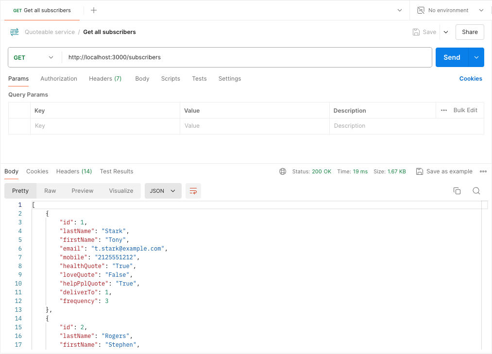

# Get started with the Quoteable Service

Welcome to the Quoteable Service! This guide will walk you through the basic steps to get started with using our API to manage subscribers and their favorite quotes.

## Prerequisites

Before you send your first API test call, ensure your operating system is correctly prepared.

To prepare your operating system, follow these instructions:

- [Prepare your Windows system](prepare-windows.md)
- [Prepare your MAC](prepare-mac.md)

## Step 1: Fork the Quoteable Service repository

1. Visit the Quoteable Service GitHub repository: <https://github.com/Ewa6/quoteable-service>
2. Click **Fork** and select **Create a new fork**. This creates the fork of the Quoteable Service repository on your GitHub.

## Step 2: Clone the Quoteable Service repository

Once you have forked the repository, you can clone it and work with it on your Mac. To do so, follow these steps:

1. Open GitHub Desktop.
2. Sign in to your GitHub account.
3. In the upper left corner, select **File** > **Clone Repository**.
4. In the **Clone Repository** dialog, go to the **GitHub.com** tab and select the **quoteable-service** repository.
5. Click **Clone**. Once the GitHub Desktop clones the repository, you can find it in the specified local directory.

## Step 3: Start the JSON server

To start the JSON server in the directory of your cloned repository, follow these steps:

1. Open a command prompt (cmd) on Windows or a terminal on your Mac.
2. Navigate to the directory where you want to start the JSON server. This is the directory where you cloned the Quoteable Service repository. For example: `cd C:\path\to\your\directory`
3. Start the JSON server:
    - on Windows: `start-server.bat`
    - on Mac: `sh start-server.sh`

The JSON server runs at `http://localhost:3000`. You can test it by running this address in your web browser.

## Step 4: Make your first API call in Postman

Now it's time to make your first API call to the Quoteable Service! To do so, follow these steps:

1. Open Postman.
2. Select the `GET` method and enter the address: `http://localhost:3000/subscribers`.
3. Click **Send**. The status of the response should be `200 OK` and the response body should return all subscribers of the Quoteable Service.

## Next Steps

Now that you have a basic understanding of how to use the Quoteable Service, you can explore the API reference for the [`subscribers` resource](../api/subscribers.md) and [`quotes` resource](../api/quotes.md). These topics introduce more detailed information on each endpoint, including request and response formats, error handling, and additional parameters.

If you need more examples and practice with the Quoteable Service, see our tutorials.

Feel free to reach out to our support team if you have any questions or need further assistance. Happy coding!
